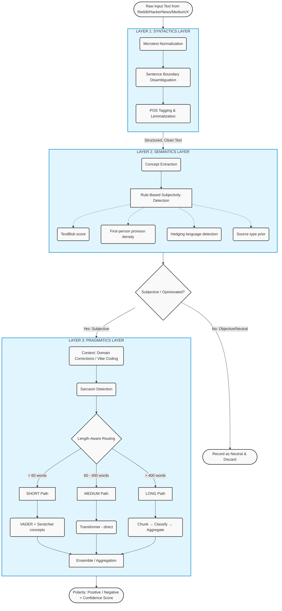

```mermaid
graph TD
    %% Input
    Input([Raw Input Text from Reddit/HackerNews/Medium/X]) --> L1

    %% Layer 1
    subgraph L1 [LAYER 1: SYNTACTICS LAYER]
        direction TB
        L1_A(Microtext Normalization) --> L1_B(Sentence Boundary Disambiguation) --> L1_C(POS Tagging & Lemmatization)
    end

    L1 --> |Structured, Clean Text| L2

    %% Layer 2
    subgraph L2 [LAYER 2: SEMANTICS LAYER]
        direction TB
        L2_A(Concept Extraction) --> L2_B[Rule-Based Subjectivity Detection]
        L2_B -.-> L2_B1(TextBlob score)
        L2_B -.-> L2_B2(First-person pronoun density)
        L2_B -.-> L2_B3(Hedging language detection)
        L2_B -.-> L2_B4(Source type prior)
    end

    L2 --> Decision{Subjective / Opinionated?}

    %% Split Path
    Decision -->|No: Objective/Neutral| Out_Neutral([Record as Neutral & Discard])
    Decision -->|Yes: Subjective| L3

    %% Layer 3
    subgraph L3 [LAYER 3: PRAGMATICS LAYER]
        direction TB
        L3_A(Context: Domain Corrections / Vibe Coding) --> L3_B(Sarcasm Detection)
        L3_B --> L3_Route{Length-Aware Routing}

        L3_Route -->|< 60 words| Path_Short[SHORT Path]
        L3_Route -->|60 - 400 words| Path_Med[MEDIUM Path]
        L3_Route -->|> 400 words| Path_Long[LONG Path]

        Path_Short --> Proc_Short(VADER + SenticNet concepts)
        Path_Med --> Proc_Med(Transformer - direct)
        Path_Long --> Proc_Long(Chunk → Classify → Aggregate)

        Proc_Short --> Ensemble[Ensemble / Aggregation]
        Proc_Med --> Ensemble
        Proc_Long --> Ensemble
    end

    %% Output
    L3 --> Output([Polarity: Positive / Negative + Confidence Score])

    %% Styling
    classDef default fill:#f9f9f9,stroke:#333,stroke-width:2px;
    classDef layer fill:#e1f5fe,stroke:#0288d1,stroke-width:2px;
    class L1,L2,L3 layer;
```
